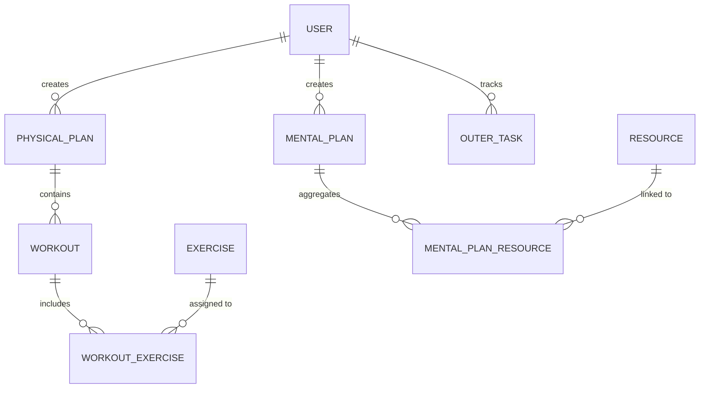

# Stepwise Backend: Asynchronous Lifestyle & Productivity API

[](https://fastapi.tiangolo.com)
[](https://sqlalchemy.org)
[](https://postgresql.org)
[](https://jwt.io)
[](https://www.docker.com/)

**Stepwise Backend** is a high-performance, asynchronous REST API built with FastAPI. It serves as the core engine for a lifestyle management platform, handling complex relational data for physical fitness, mental wellness, and task tracking.

---

## 🚀 Key Features

- **Full Async Pipeline:** Leverages `FastAPI`, `SQLAlchemy 2.0` (async), and `asyncpg` for non-blocking I/O operations.
- **Robust Security:** JWT-based authentication with `bcrypt` password hashing and secure dependency injection.
- **Relational Complexity:** Sophisticated database schema with one-to-many and many-to-many relationships.
- **Scalable Architecture:** Clean, modular project structure following industry best practices.
- **DevOps Ready:** Fully containerized with Docker and version-controlled database migrations via Alembic.

---

## 🏗️ Project Architecture

The system follows a modular design to ensure high maintainability and testability:

```text
project-root/
├── app/                        # Main Application Core
│   ├── auth/                   # Security, JWT, and Auth Logic
│   ├── core/                   # Global Config & DB Engine
│   ├── models/                 # SQLAlchemy 2.0 Declarative Models
│   ├── routers/                # FastAPI Endpoints (Modules: Physical, Mental, Tasks)
│   ├── schemas/                # Pydantic Data Validation Models
│   └── main.py                 # Application Entry Point
├── migrations/                 # Alembic Database Revisions
├── Dockerfile                  # Production Environment Config
├── docker-compose.yml          # Local Orchestration
└── pyproject.toml              # Dependency Management (Poetry)
```

---

## 🧬 Database Schema & Relationships

The backend manages three primary domains linked to a centralized **User** entity:



### **Core Entities:**
- **Physical Tracking:** Manages metrics like BMI, weight, and adaptive workout progressions.
- **Mental Wellness:** Tracks educational resources (books, courses, videos) and learning progress.
- **Task Management:** A flexible CRUD system for external daily objectives.

---

## 🛠️ Performance & Optimization

- **Connection Pooling:** Optimized database connections using SQLAlchemy's async pool.
- **Eager Loading:** Implements `joinedload` and `selectinload` strategies to eliminate N+1 query problems.
- **Pydantic V2:** High-speed data validation and serialization.
- **Async Interceptors:** Middleware and dependency-based security checks for low-latency authorization.

---

## 🚦 Quick Start

### 1. Local Environment
```bash
# Clone the repository
git clone [https://github.com/VRaitzev/Stepwise_backend.git](https://github.com/VRaitzev/Stepwise_backend.git)
cd stepwise-backend

# Install dependencies via Poetry
poetry install

# Start the dev server
uvicorn app.main:app --reload
```

### 2. Docker Deployment
```bash
docker-compose up --build
```
*API accessible at `http://localhost:8000`. Interactive docs at `/docs` (Swagger) and `/redoc`.*

---

## 📈 Roadmap

- [ ] **Caching Layer:** Integration with Redis for high-frequency data.
- [ ] **Real-time Engine:** WebSocket support for live progress notifications.
- [ ] **Background Processing:** Celery/Redis for handling long-running analytical tasks.
- [ ] **Advanced Monitoring:** Integration with Prometheus and Grafana.

---

## 🛡️ Security Implementation

- **Encryption:** `Passlib` with `bcrypt` for industry-standard hashing.
- **Tokenization:** Stateless JWT tokens with configurable expiration and automatic verification layers.
- **Data Integrity:** Strict Pydantic schemas prevent SQL injection and data leakage.
